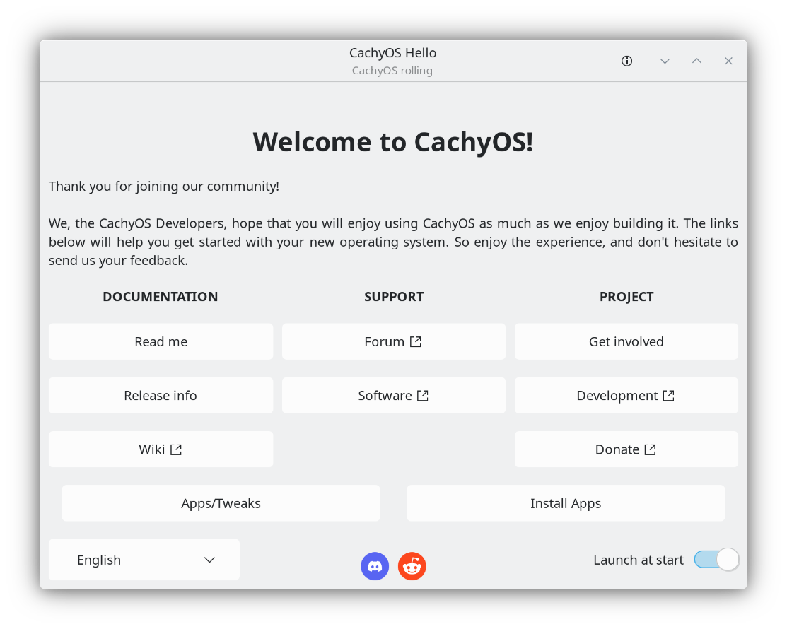

<div align="center">
  <h1>CachyOS Hello</h1>
  <p>
    <strong>Welcome screen for CachyOS written in Rust</strong>
  </p>
  <p>



[](https://deps.rs/repo/github/cachyos/cachyos-welcome)
<br />
[](https://github.com/cachyos/cachyos-welcome/actions/workflows/rust.yml)

  </p>
</div>

## Overview

CachyOS Hello is a GTK3 application that serves as the main entry point for new CachyOS users. It provides a graphical interface for system setup, maintenance, and configuration — including service tweaks, one-click fixes, encrypted DNS configuration, quick access to CachyOS tools (Package Installer, Kernel Manager), and a guided installer path on live ISO. Supports 32 languages with runtime locale switching. Also ships a full CLI for scripting and automation.

## CLI

```
cachyos-hello <COMMAND>
```

### `fix <ACTION>`

| Action | Description |
|---|---|
| `update-system` | Update all system packages |
| `reinstall-packages` | Reinstall all native packages |
| `reset-keyrings` | Reset and repopulate pacman keyrings |
| `remove-lock` | Remove pacman database lock file |
| `clear-cache` | Clear package cache |
| `remove-orphans` | Remove orphan packages |
| `rank-mirrors` | Rank mirrors by speed |
| `install-gaming` | Install gaming meta-packages |
| `install-winboat` | Install Winboat |
| `show-kwin-debug` | Open KWin Wayland debug console |

### `tweak <ACTION>`

```
cachyos-hello tweak enable <NAME>
cachyos-hello tweak disable <NAME>
cachyos-hello tweak list
```

Available tweaks: `psd`, `oomd`, `bpftune`, `bluetooth`, `ananicy`, `cachy-update`

### `dns <ACTION>`

```
# Use a preconfigured provider
cachyos-hello dns set --connection <NAME> --server <SERVER> [--dot] [--doh]

# Use custom DNS addresses
cachyos-hello dns set-custom --connection <NAME> [--ipv4 <ADDRS>] [--ipv6 <ADDRS>] [--dot] [--doh-url <URL>]

# Reset to automatic
cachyos-hello dns reset --connection <NAME>

# List available connections / providers / test latency
cachyos-hello dns list-connections
cachyos-hello dns list-servers
cachyos-hello dns test-latency
```

---

## Building

**Dependencies:** gtk+-3.0, glib-2.0, gio-2.0, Rust toolchain, Meson

```sh
meson setup build
meson compile -C build
meson install -C build  # optional
meson test -C build     # optional
```

---

## License

GPL-3.0 — see [LICENSE](LICENSE) for details.
